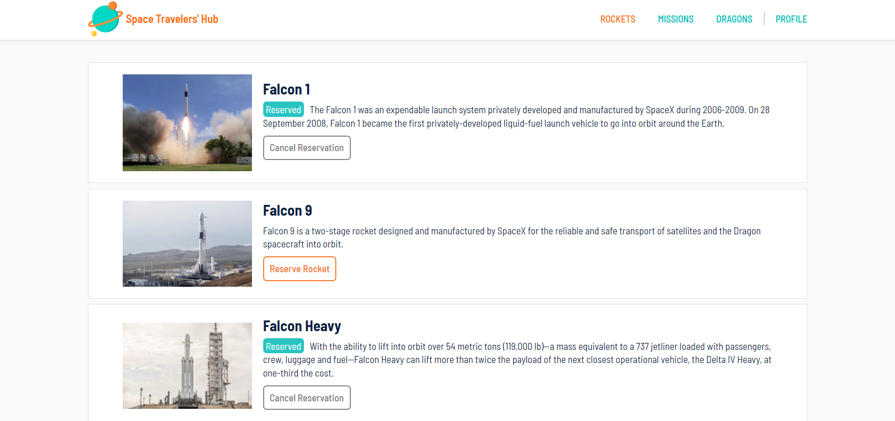
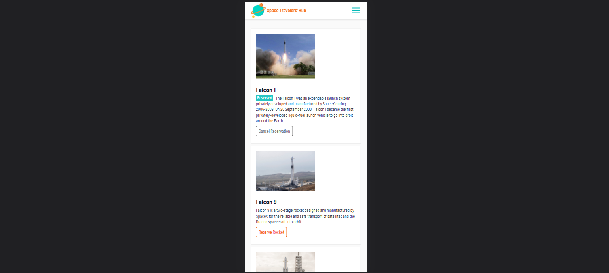

# Space Travelers' Hub
> The website offers users information about space travels classified between rockets, dragons, and missions. Users can book and cancel rocket and dragon reservations and join and leave missions. The Profile page lists all user choices.

## Features

The website displays space travels information using react components to:

- Navigation between four pages, rockets, missions, dragons, and profile section.
- Users can book and cancel rockets and dragons in Rockets and Dragons pages respectively.
- Users can join and leave missions on the Missions page.
- The Profile page lists all user's Rockets, Dragons, and Missions choices.
- The website retrieves space travels data from a third-party API.
- The data chosen by the user is temporarily saved in the redux store that is emptied after reloading the page.

## Built With

- JavaScript
- React
- Redux
- SCSS

## Live Demo

[Space travels](https://spacetravelsgaby.herokuapp.com/)

## Getting Started

To get a local copy up and running follow these simple example steps.

### Prerequisites

- Have `git` installed on your local computer.

### Install

- Clone this repository to your local computer. Choose the location you prefer.
- Run the command `npm install` to install all project's dependencies.

### Usage

- To begin the development, run the command `npm start`.
- The project will automatically open the `index.html` file in a browser.

### Deployment

- To create a production bundle, run the command `npm run build`.
- Deploy the `build` folder.

## Authors

👤 **Gabriela Sánchez Espirilla**

- GitHub: [@gabyse1](https://github.com/gabyse1)
- LinkedIn: [Gabyse](https://www.linkedin.com/in/gabyse/)
- Twitter: [@gabyse0](https://twitter.com/gabyse0)

## 🤝 Contributing

Contributions, issues, and feature requests are welcome!

Feel free to check the [issues page](../../issues/).

## Show your support

Give a ⭐️ if you like this project!

## Acknowledgments

- Linters: [Microverse](https://github.com/microverseinc/linters-config)

## 📝 License

This project is [MIT](./MIT) licensed.
